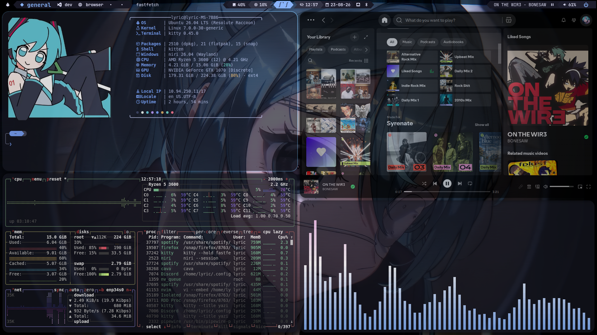
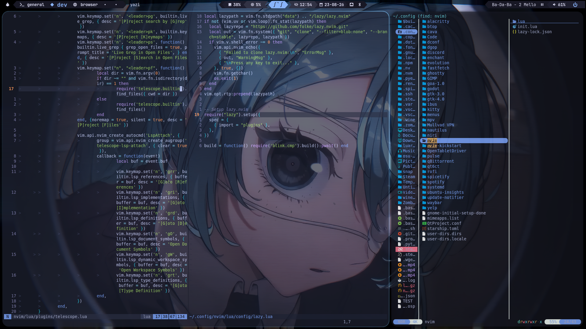

# NiruMiku Desktop

A collection of wayland configuration files for various packages on niri. Main programs include:
  - `Niri`: Wayland compositor ([link](https://github.com/niri-wm/niri))
  - `Waybar`: Taskbar manager ([link](https://github.com/alexays/waybar))
  - `Kitty`: Terminal emulator ([link](https://sw.kovidgoyal.net/kitty/))

## Showcase
Overview Workspace

Development Workspace

## Instructions
This repo is by no means a complete niri configuration; it simply contains various configuration folders for the niri programs I run. If you'd like to replicate any features:
  1. Copy the contents of a `src/*` directory. Any such directory belongs in your assigned `.config` directory (for me this is `~/.config`, but check specific program defaults) along with a complete installation of the corresponding program. 
  2. Contact me! I'm no experienced user but I can hopefully help clarify any feature you see in the examples.
